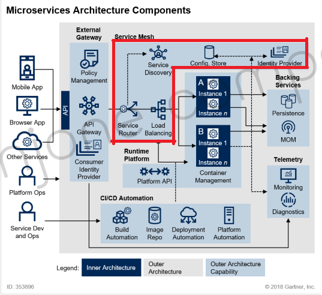

# Sec1 - Cloud Native Application 소개
> 새로운 내용만 정리

## 12factors + 3
* 12 factors : heroku에서 제시한 Cloud Native Architecute를 개발하거나 운영할 때 고려해야 할 항목
* +3 : pivotal에서 12 Factors에 3가지 항목을 추가
* [참고링크](https://devkingdom.tistory.com/375)

 

## Hateoas
* RESTful API의 응답 리소스에 해당 API와 관련된 리소스를 제공하는 링크들을 추가로 알려줌
  * ex. 회원 정보 API - 회원 수정 API, 회원 가입 API 등등...
* REST 구현 단계
  * 

 

## MSA 표준 구성 요소
* MSA 표준 구성 요소
  * 
* Service Mesh 란?
  * MSA 시스템을 적용한 내부 통신
  * 서비스간의 통신을 추상화
    * Configuration
    * Routing
    * Authentication
    * Load Balancing
    * Resiliency(탄력성)
    * Discovery(검색)
    * Encryption(암호화)
    * Instrumentaion - 오류 진단, 정보 추척? [Todo]
  * Infrastructure Layer
  * 그림에서 빨간색 부분

 

## 사용할 Spring Cloud Project
* Config
  * 환경 설정
* Netflix
  * Hystrix - Fault Tolerance
  * Eureka - **naming server**에 해당
    * 서비스 등록, 서비스 위치 정보 확인
* Gateway
  * spring cloud 이전 - Ribbon & zuul
  * spring cloud 이후 - **Gateway**: 강의에서 사용할 project
* Security
* Sleuth
* Starters
* OpenFeign
  * feign client - REST clients