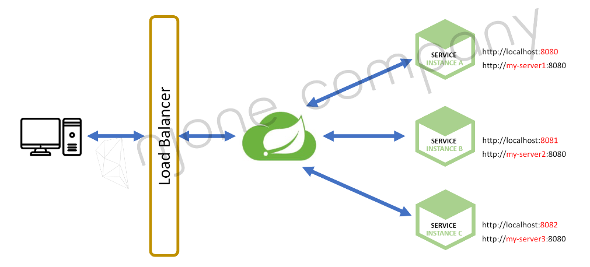
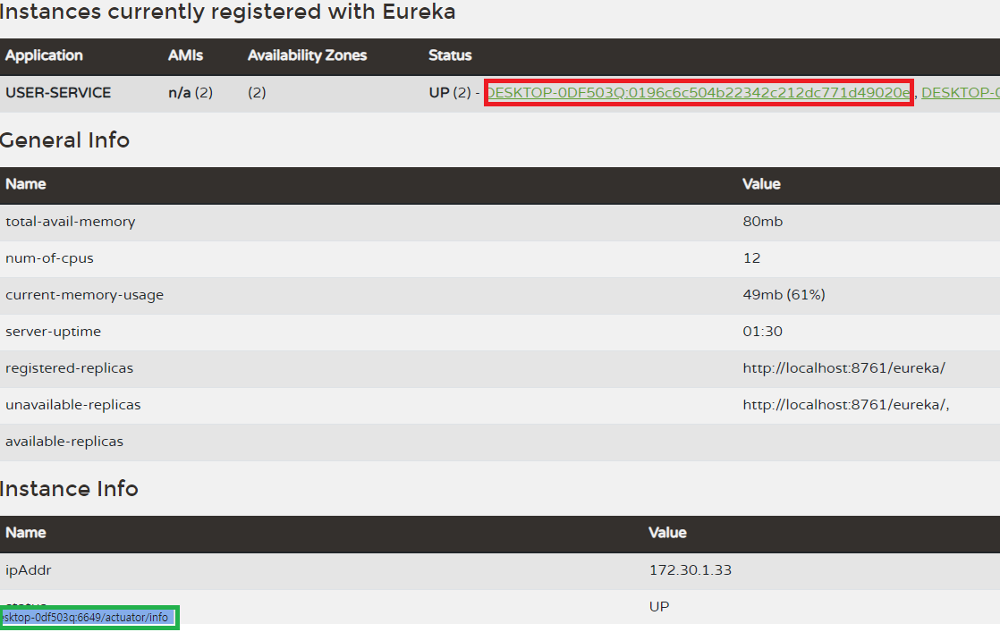

# Service Discovery
> Spring Cloud Netflix Eureka - Service Discovery

## 1. 그림으로 보는 Eureka 기능
* 

<br>

## 2. Eureka Server 생성
* Discovery Service Application 클래스에 `@EnableEurekaServer` 어노테이션 붙이기
* 설정 정보
  ```yml
  server:
  port: 8761

  spring:
  application:
      name: discoveryservice

  eureka:
  client:
      register-with-eureka: false # 레지스트리에 자신을 등록할지에 대한 여부 (디폴트 true)
      fetch-registry: false       # 레지스트리에 있는 정보를 가져올지에 대한 여부 (디폴트 true)
  ```

<br>

## 3. Eureka Server에 Service 등록
* Application 클래스에 `@EnableDiscoveryClient` 어노테이션 붙이기
* 설정 정보
  ```yml
  server:
  port: 9001

  spring:
  application:
      name: user-service

  eureka:
  client:
      register-with-eureka: true
      fetch-registry: true
      service-url:
      defaultZone: http://127.0.0.1:8761/eureka
  ```
* 로컬 빌드 방법
  1. 인텔리제이에서 프로젝트 빌드
  2. Edit Configuration에서 기존의 프로젝트 설정 복붙 이후, VM option 으로 포트 변경, 빌드
     * -Dserver.port=9002
  3. CLI로 빌드할 프로젝트 경로로 이동, 아래 스크립트로 빌드
     * mvn spring-boot:run -D'spring-boot.run.jvmArguments'='-Dserver.port=9003'
  4. CLI로 빌드할 프로젝트 경로로 이동, mvn 명령어로 빌드
     1. mvn clean
     2. mvn compile package (target 폴더 재생성, jar파일 생성)
     3. 스크립트에 `Building jar` 이라고 jar 파일 경로가 표시됨
     4. java -jar -D'server.port=9004' ./target/user-service-0.0.1-SNAPSHOT.jar

<br>

## 4. Eureka Service 랜덤 포트 지정하기
* 랜덤 포트
  * 3번에서 매번 포트를 변경하여 빌드하는 방법은 불편함
  * **port를 0**으로 설정하면 랜덤포트 사용 가능
* 랜덤포트(0) 지정시 Eureka Status에서 등록된 App개수가 하나로 보일 수 있음
  * instance-id를 지정해 주면 정상적으로 표시됨 - 설정정보에서 `instance-id` 항목 확인
* 설정 정보
  ```yml
  server:
    port: 0

  spring:
    application:
      name: user-service

  eureka:
    instance:
      instance-id: ${spring.cloud.client.hostname}:${spring.application.instance_id:${random.value}}
    client:
      register-with-eureka: true
      fetch-registry: true
      service-url:
        defaultZone: http://127.0.0.1:8761/eureka
  ```
* 로컬 빌드 방법
  1. 인텔리제이에서 프로젝트 빌드
  2. CLI로 빌드할 프로젝트 경로로 이동, mvn 명령어로 빌드
     * 포트 지정 필요 없으므로 스크립트는 간단 - `mvn spring-boot:run`
* 랜덤 포트 번호 확인 방법
  * Eureka Status에서, 아래 이미지의 빨간색 박스에 마우스를 올리기만 하면 초록색 박스로 확인 가능
  * 또는 빨간색 박스 클릭해서 주소로 포트 확인
  * 

## 5. `@RequestHeader`
* `@RequestHeader("헤더")` 가 붙은 api의 경우 헤더를 매개변수로 받아 사용함
  * 아래의 **/message** 경로의 api 요청시 second-request 헤더가 없으면 예외가 발생함
  * ```java
      @GetMapping("/message")
      public String message(@RequestHeader("second-request") String header) { // @RequestHeader(value = "second-request") 과 같음
          log.info(header);
          return "Hello in second service with header.";
      }
    ```
* 아래의 예제에서는 second-request 헤더가 없을 경우 기본 헤더로 "Unknown"을 사용
  * 아래의 **/message** 경로의 api 요청시 요청 헤더가 없거나 second-request 헤더가 아닌 다른 헤더가 있으면 예외가 발생하지는 않지만 Unknown 헤더와 Unknown헤더값이 할당됨
  * 요청시 second-request 헤더가 있다면 해당하는 헤더값을 매개변수로 사용가능함
  * ```java
      @GetMapping("/message")
      public String message(@RequestHeader(value = "second-request", defaultValue = "Unknown") String header) {
          log.info(header);
          return "Hello in second service with header.";
      }
    ```