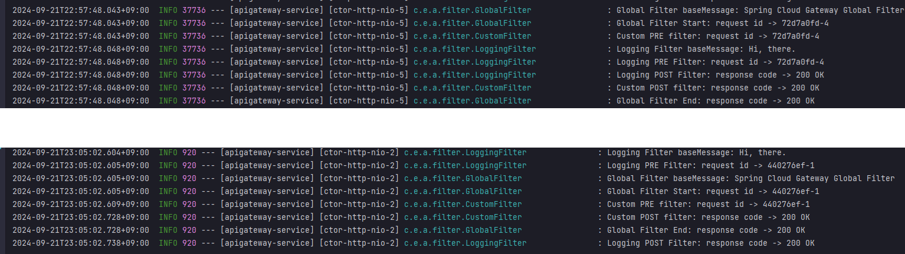
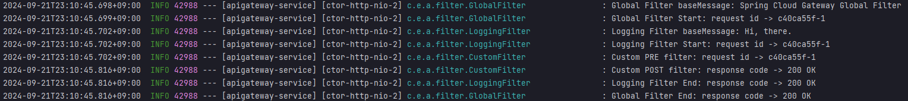

# API Gateway Service
> Spring Cloud에서 API Gateway 역할을 하는 라이브러리들 살펴보기
* Spring Cloud Gateway
  * filter
  * 로드밸런싱

## deprecated spring project - Ribbon, Zuul
* Zuul
  * 기능
    * Routing - ex. port forwarding
    * filter - 사전처리(ex.인증), 사후처리(ex.로깅)
  * 성능이 Nginx보다 떨어짐
  * 동기적인 방식으로 요청을 처리
    * **Tomcat** 서버로 동작
  * boot 2 버전부터는 비동기 방식을 지원하긴 하지만, 다른 spring 디펜던시들과의 호환성이 좋지 않음
* Ribbon
  * **client side** Load balancer
  * 동기 블로킹 방식으로 요청 처리
    * Blocking방식의 HttpClient인 RestTemplate만 지원
* **Ribbon과 Zuul은 스프링부트2.4 이후로 더이상 지원x**
  * Spring Boot 2.4부터 maintenance 상태
    * 비동기 동작 방식에 적합하지 않기 때문
  * Zuul -> `Spring Cloud Gateway`
  * Ribbon -> `Spring Cloud Loadbalnacer`

<br><br>

## Spring Cloud Gateway
* dependancy
  * Spring Cloud Routing - `Reactive Gateway`
    * spring-cloud-starter-gateway: **Netty** 서버로 동작 (비동기 논블로킹)
    * spring webFlux 위에서 동작
  * Spring Cloud Routing - `Gateway`
    * spring-cloud-starter-gateway-mvc: **Tomcat** 서버로 동작 (동기 블로킹)
* 비동기 처리가 가능함 (`Reactive Gateway` 디펜던시 사용시)
* gateway 설정정보 예시
  ```yml
  server:
    port: 8000

  eureka:
    client:
      register-with-eureka: true # 현재 애플리케이션을 Eureka Server에 등록하지에 대한 여부
      fetch-registry: true # Eureka Server로부터 인스턴스들의 정보를 주기적으로 가져올 것인지에 대한 여부
      service-url:
        defaultZone: http://localhost:8761/eureka # 유레카 서버 url

  spring:
    application:
      name: apigateway-service
    cloud:
      gateway:
        default-filters: # 전역 필터 설정 (GlobalFilter클래스의 filter를 default로 사용)
          - name: GlobalFilter # class 이름
            args: # 위의 클래스에서 상속받은 AbstractGatewayFilterFactory의 제네릭에 표시된 클래스의 파라미터들
              baseMessage: Spring Cloud Gateway Global Filter
              preLogger: true
              postLogger: true
        routes: # 라우팅 규칙 목록 설정
          - id: first-service
            uri: lb://MY-FIRST-SERVICE # uri를 직접 명시해 주어도 되지만(ex. http://localhost:8081/) 유레카에 등록된 서비스 이름으로 등록해도 로드밸런싱이 가능하다
            predicates:
              - Path=/first-service/**
            filters:
              # - AddRequestHeader=first-request, first-request-header-by-yaml
              # - AddResponseHeader=first-response, first-response-header-from-yaml
              - CustomFilter # 추가로 전달할 파라미터가 없으면 그냥 이렇게 쓰면되지만, 있다면 name으로 지정해 주어야 함(second-service의 filter 참고)
          - id: second-service
            uri: lb://MY-SECOND-SERVICE # http://localhost:8082/
            predicates:
              - Path=/second-service/**
            filters:
              # - AddRequestHeader=second-request, second-request-header-by-yaml
              # - AddResponseHeader=second-response, second-response-header-from-yaml
              - name: CustomFilter
              - name: LoggingFilter
                args:
                  baseMessage: Hi, there.
                  preLogger: true
                  postLogger: true
  ```

<br> <br>

## Filter
* PRE, POST filter 예시
  * PRE filter - 인증 처리와 같은 기능에 해당
  * POST filter - 로깅 처리와 같은 기능에 해당
* 전역 filter
  * 위의 설정 정보에서, `spring.cloud.gateway.default-filters`에 해당
  * 전역 필터로 사용 가능
  * `-name:`에 적용할 필터에 해당하는 java 클래스 이름 작성
* 커스텀 filter
  * 위 설정 정보에서 `spring.cloud.gateway.routes`에 해당

### yaml 설정파일 이용하지 않고 java코드로 filter 작성하기
* @Configuration으로 설정정보 등록하여 filter를 java코드로 작성
  ```java
  @Configuration
  public class FilterConfig {
      @Bean
      public RouteLocator gatewayRoutes(RouteLocatorBuilder builder) {
          return builder.routes()
                  .route(r -> r.path("/first-service/**") // 해당 path로 요청이 들어오면,
                          .filters(f -> f.addRequestHeader("first-request", "first-request-header-by-java") // 요청헤더 추가하여 요청 라우팅
                                  .addResponseHeader("first-response", "first-response-header-from-java") // 응답헤더 추가하여 응답 라우팅
                          ) // filter를 이용하여 요청헤더와 응답헤더를 추가 가능하다.
                          .uri("http://localhost:8081")) // 도착지 설정
                  .route(r -> r.path("/second-service/**")
                          .filters(f -> f.addRequestHeader("second-request", "second-request-header-by-java")
                                  .addResponseHeader("second-response", "second-response-header-from-java"))
                          .uri("http://localhost:8082"))
                  .build();
      }
  }
  ```

### filter 우선순위 처리
* `Ordered.LOWEST_PRECEDENCE`
  ```java
  // 예시 필터
  @Override
  public GatewayFilter apply(Config config) {
      GatewayFilter filter = new OrderedGatewayFilter((exchange, chain) -> {
          ServerHttpRequest request = exchange.getRequest();
          ServerHttpResponse response = exchange.getResponse();

          log.info("Logging Filter baseMessage: {}", config.getBaseMessage());

          if (config.isPreLogger()) {
              log.info("Logging PRE Filter: request id -> {}", request.getId());
          }
          return chain.filter(exchange).then(Mono.fromRunnable(() -> {
              if (config.isPostLogger()) {
                  log.info("Logging POST Filter: response code -> {}", response.getStatusCode());
              }
          }));
      }, Ordered.LOWEST_PRECEDENCE); // filter 순서 정할 수 있음, HIGHEST_PRECEDENCE로 하면 Global filter보다 먼저 수행됨

      return filter;
  }
  ```
* 결과 예시1
  * 위의 로그가 `LOWEST_PRECEDENCE`, 아래의 로그가 `LOWEST_PRECEDENCE` 적용된 경우임
  * 
* 결과 예시2
  * 우선순위 처리 코드가 따로 없는 경우에는 설정정보에 작성된 필터 순서대로 동작하는것 같음
  * ~~~yml
      gateway:
        default-filters: # default-filter를 global filter으로 사용
          - name: GlobalFilter # class 이름
            args: # 위의 클래스에서 상속받은 AbstractGatewayFilterFactory의 제네릭에 표시된 클래스의 파라미터들
              baseMessage: Spring Cloud Gateway Global Filter
              preLogger: true
              postLogger: true
        routes: 
          - id: second-service
            uri: lb://MY-SECOND-SERVICE
            predicates:
              - Path=/second-service/**
            filters:
              - AddRequestHeader=second-request, second-request-header-by-yaml
              - AddResponseHeader=second-response, second-response-header-from-yaml
              - name: LoggingFilter
                args:
                  baseMessage: Hi, there.
                  preLogger: true
                  postLogger: true
              - name: CustomFilter
    ~~~
  * 위의 설정정보에 해당하는 실행 로그 결과
  * 

<br> <br>

## Load Balancing 로드 밸런싱
* Eureka에 등록된 서비스들의 이름을 기준으로 로드밸런싱 가능함
* uri: lb://{Eureka에 등록된 서비스 이름}
  * 자세한 코드는 위의 설정정보에서 `spring.cloud.routes.uri` 항목 확인
  * 유레카에 등록된 서비스 이름은 `spring.application.name:`에 해당함


<br> <br>

## 환경 변수 가져오기 (spring Environment 인스턴스)
* Environment인스턴스를 이용하여 환경변수 속성들 가져올 수 있음
  * 뒤에서는 `@Value` 사용할 예정임, Environment 사용 권장 x

```java
@RestController
@RequestMapping("/first-service")
@RequiredArgsConstructor
@Slf4j
public class FirstServiceController {
    private final Environment env;
    ...

    @GetMapping("/check")
    public String check(HttpServletRequest request) {
        log.info("Server port={}", request.getServerPort());

        return String.format("This is a message from first service on PORT %s."
                , env.getProperty("local.server.port")); // 환경변수에 등록된 포트 가져옴

    }
}
```