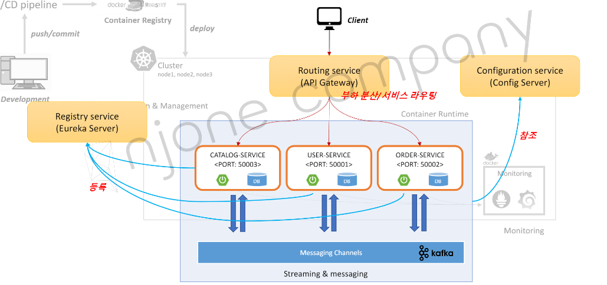

# E-commerce App 설계
> section 4에서 만들 APP의 설계 내용

 

## APP 전체 구성

 

## APP 구성 요소
* Config Server - github에 저장
* Eureka Server - 서비스 등록 및 검색
* API Gateway Server - 로드밸런싱 및 라우팅
* Microservices - 서비스:회원/주문/상품
* Queueing system - kafka로 서비스 간 메시지 pub & sub

 

## API
* Catalog service
  * 상품 목록 조회
* User service
  * 전체 사용자 정보 조회
  * 사용자 등록
  * 사용자 정보 & 주문 내역 조회
* Order service
  * 주문 등록
  * 주문 확인

