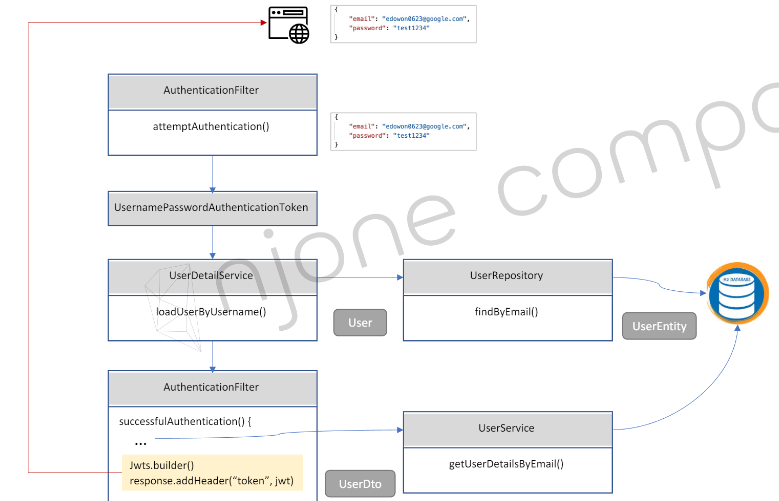

# 로그인 기능 구현
* Spring Security를 이용하여 인증과 인가처리
* 사용자 요청에 대해 AuthenticationFilter를 거칠 수 있도록 
* AuthenticationFilter를 이용하여 인증 시도 및 인증 후 로직 처리(JWT토큰 생성)
* 
* 로그인 과정
  * 

## HttpServlet Request - InputStream - mapper.readValue

## UsernamePasswordAuthenticationFilter 상속
* UsernamePasswordAuthenticationFilter
  * [document](https://docs.spring.io/spring-security/site/docs/current/api/org/springframework/security/web/authentication/UsernamePasswordAuthenticationFilter.html)
* UsernamePasswordAuthenticationFilter::attemptAuthentication
* UsernamePasswordAuthenticationFilter::successfulAuthentication
* 예시 코드

<br>

## UsernamePasswordAuthenticationToken
* 인증 토큰 생성
* UsernamePasswordAuthenticationToken
  * [document](https://docs.spring.io/spring-security/site/docs/4.0.x/apidocs/org/springframework/security/authentication/UsernamePasswordAuthenticationToken.html)
  * User의 email과 password를 인증 토큰으로 변경
* 예시 코드

<br>

## UserDetailsService 상속
* UserDetailsService::loadUserByUsername

<br>

## Spring Security


## Spring Security 인가
* WebSecurityConfigurerAdapter을 상속받아 인가 기능을 구현했었는데 Spring boot 3 부터 삭제됨
* 정확히는 spring security 5.7.0 부터 WebSecurityConfigurerAdapter는 deprecate됨
* 이후, spring security 에서는 SecurityFilterChain 을 이용한 설정을 권장
* 기존 & 새로운 방식 코드 비교
  ```java
  // 기존(spring boot 3이전, spring security 5.7.0 이전) WebSecurityConfigurerAdapter 를 이용한 인가 설정
  @Configuration
  public class SecurityConfiguration extends WebSecurityConfigurerAdapter {

      @Override
      protected void configure(HttpSecurity http) throws Exception {
          http
              .authorizeHttpRequests((authz) -> authz
                  .anyRequest().authenticated()
              )
              .httpBasic(withDefaults());
      }

  }

  // spring security 5.7.0이후 SecurityFilterChain을 Bean으로 등록하는 새로운 방식
  @Configuration
  public class SecurityConfiguration {

      @Bean
      public SecurityFilterChain filterChain(HttpSecurity http) throws Exception {
          http
              .authorizeHttpRequests((authz) -> authz
                  .anyRequest().authenticated()
              )
              .httpBasic(withDefaults());
          return http.build();
      }

  }
  ```

<br>

## 