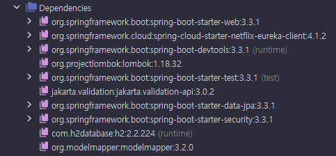

# Users Microservice
> Users 서비스 프로젝트 설정 및 구현

* 처음본 내용들만 정리

## Dependancy 정보


<br>

## In-memory 초기화 이슈
* h2 database embedded DB 생성시 초기화할 데이터(Table)가 아무것도 없으면 인메모리 DB 생성이 안됨
* 해결
  * ddl-auto 설정을 create-drop 으로 설정
  * Entity 아무거나 하나 만들어 두면 됨
  * 이후 http://localhost:{해당 application의 port}/{spring.h2.console.path} 로 접속
    * 403뜨면 spring security 권한 부여(인가) 이슈
      * SecurityFilterChain에서 해당 경로의 http 요청에 대한 인가 설정이 필요 (http.authorizeHttpRequests 코드)
* 설정 정보 예시
  ```yml
  spring:
    application:
      name: user-service
    jpa:
      hibernate:
        ddl-auto: create-drop
    h2:
      console:
        enabled: true
        settings:
          web-allow-others: true
        path: /h2-console
    datasource:
      driver-class-name: org.h2.Driver
      url: jdbc:h2:mem:testdb
      username: sa
      password:
  ```

<br>

## ModelMapper
* [참고 링크](https://devwithpug.github.io/java/java-modelmapper/)
* MatchingStrategies
  * STANDARD 전략 - modelMapper.getConfiguration().setMatchingStrategy(MatchingStrategies.STANDARD)
  * LOOSE 전략 - modelMapper.getConfiguration().setMatchingStrategy(MatchingStrategies.LOOSE)
  * STRICT 전략 - modelMapper.getConfiguration().setMatchingStrategy(MatchingStrategies.STRICT)
* STRICT 전략 사용시 source와 destination의 속성들의 이름이 정확히 일치해야 함
* 사용 예시
  ```java
  @PostMapping("/users")
  public ResponseEntity<ResponseUser> createUser(@RequestBody RequestUser user) {
        ModelMapper mapper = new ModelMapper();
        mapper.getConfiguration().setMatchingStrategy(MatchingStrategies.STRICT);

        UserDto userDto = mapper.map(user, UserDto.class);
        userService.createUser(userDto);

        ResponseUser responseUser = mapper.map(userDto, ResponseUser.class); // 매핑 (source , destination)

        return ResponseEntity.status(HttpStatus.CREATED).body(responseUser);
  }
  ```

<br>


## @JsonInclude(JsonInclude.Include.NON_NULL)
* null 응답 처리용 어노테이션
* Json 데이터로 변환할때 null인 값들은 제외시켜 줌
* 사용 예시
  ```java
  @Data
  @JsonInclude(JsonInclude.Include.NON_NULL)
  public class ResponseOrder {
      private String productId;
      private Integer qty;
      private Integer unitPrice;
      private Integer totalPrice;
      private Date createdAt;
      private String orderId;
  }
  ```