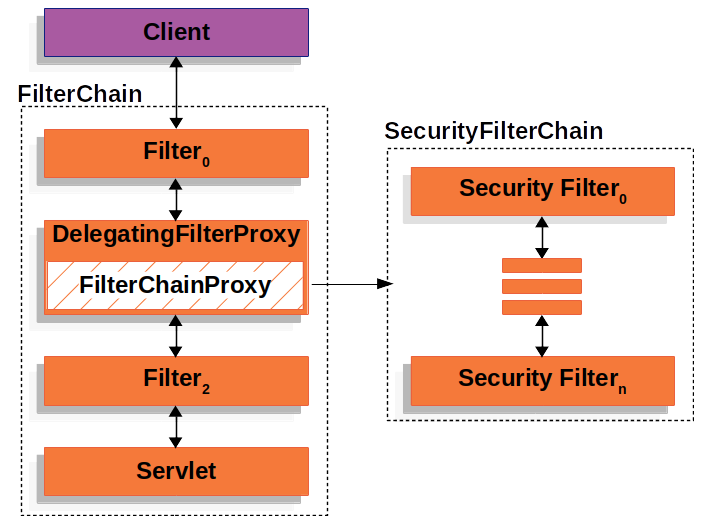

# Spring Security
* Spring Security의 실제 동작은 Servlet Filter (`javax.servlet.Filter` 인터페이스 구현체) 를 통해 이루어 짐
* Spring Security는 필터의 집합체
* Spring Security는 Servlet Filter 레벨에서 인증 및 인가를 처리하기 위한 프레임워크

<br>

## Spring Security 사용하는 이유?
* 인증과 인가 기능을 표준화하고 자동화할 수 있어
* 개발자가 보안 관련 코드를 직접 작성하지 않고도 높은 수준의 보안 기능을 쉽게 구현할 수 있음
* 이를 통해 핵심 비즈니스 로직 개발에 집중할 수 있다는 장점이 있음 (개발 및 유지보수 복잡성 낮춰줌)
* 인증, 인가, 세션 관리, CSRF 방어, XSS 방어 등의 보안 기능을 제공함

<br>

## Spring Security는 왜 Servlet Filter기반으로 동작할까?
> Java 웹 애플리케이션의 구조와 보안 요구 사항에 적합한 특성을 제공하기 때문
1. Servlet Filter의 역할과 위치
   * Servlet Filter는 Java EE 표준 스펙으로, 클라의 요청이 실제 비즈니스 로직(ex. Spring MVC의 DispatcherServlet)에 도달하기 전에, HTTP 요청과 응답을 가로채고 처리할 수 있음
   * 즉, Servlet Filter의 특성을 활용하여 요청이 Spring MVC나 다른 애플리케이션 로직에 도달하기 전 인증 및 인가 처리
2. 보안 강화
   * 요청이 유효하지 않거나 보안 위협이 있는 경우 필터 단계에서 차단
     * 보안 위협(예: 잘못된 토큰, 세션 탈취 등)을 초기 단계에서 탐지하고 대응
     * CSRF 방어, XSS 방어 등 전역적인 보안 작업 수행
3. 유연성과 확장성
   * 다양한 인증 방식 지원
     * 예를 들어, 하나의 애플리케이션에서 세션 기반 인증과 JWT 기반 인증을 동시에 지원할 수 있음
     * 요청별로 다른 SecurityFilterChain을 적용함으로써 가능
   * 요청 조건에 따른 처리
     * URL 패턴뿐만 아니라, HTTP 메서드, 헤더 등 다양한 조건(RequestMatcher)을 기준으로 특정 필터 체인을 실행할 수 있음
4. 표준 스펙 준수
   * Servlet Filter는 Java EE 표준 스펙으로 정의된 기능이며, 대부분의 Java 웹 애플리케이션 서버(WAS)에서 지원
   * Spring Security가 Servlet Filter로 동작하면 표준화된 방식으로 다양한 WAS와 통합될 수 있음

<br>

## DelegatingFilterProxy
* Spring Security는 Servlet Filter로 동작함
* 하지만 Servlet Filter는 Servlet Container에서 직접 관리되기 때문에,
* Spring IoC Container에서 관리되는 스프링 빈을 주입받지 못해 Spring의 여러 기능을 활용할 수 없음
* 여기서 이를 가능하게 해주는 것이 `DelegatingFilterProxy`임
  * Servlet Container와 Spring IoC Container 사이를 **연결해 주는 역할**을 함
* 자세한 동작 방식 설명
  * Spring Framework에서는 DelegatingFilterProxy를 사용하여 필터의 관리를 Spring의 ApplicationContext로 위임한다고 표현
  * 클라이언트의 요청이 들어오면 DelegatingFilterProxy가 요청을 가로채서 등록된 필터 Bean을 찾아서 실행하는 방식
  * 즉, DelegatingFilterProxy는 서블릿 필터의 대리자 역할을 수행하여 Spring ApplicationContext 내에서 등록된 필터 빈을 실행시키는 역할을 함
  * 이를 통해 Spring의 의존성 주입(Dependency Injection)이 가능하며, 필터가 Bean으로 선언되어 다른 Spring Container내에서 동작이 가능함

<br>

## SecurityFilterChain
* Spring Security에서 사용하는 필터 체인으로 인증과 인가에 대한 여러 필터들이 정의될 수 있음
* DelegatingFilterProxy를 통해 SecurityFilterChain이라는 Bean을 사용가능
* [공식 문서 참고](https://docs.spring.io/spring-security/reference/servlet/architecture.html)
* 
* SecurityFilterChain 빈 등록 예시
    ```java
    // SecurityFilterChain 빈 등록 예시
    @Configuration
    @EnableWebSecurity
    public class SecurityConfig {

        @Bean
        public SecurityFilterChain filterChain(HttpSecurity http) throws Exception {
            http
                .csrf(Customizer.withDefaults())
                .authorizeHttpRequests(authorize -> authorize
                    .anyRequest().authenticated()
                )
                .httpBasic(Customizer.withDefaults())
                .formLogin(Customizer.withDefaults());
            return http.build();
        }

    }
    ```

* SecurityFilterChain 빈 및 Custom Filter 등록하는 방법 예시
  * Custom Filter를 SecurityFilterChain에 등록하고 싶다면,
  * @Component를 통해 WAS의 FilterChain에 등록할 것이 아니라, 다음과 같이 SecurityFilterChain에 등록해야 한다.
    ```java
    @Configuration
    @EnableWebSecurity
    public class SecurityConfig {

        @Bean
        SecurityFilterChain filterChain(HttpSecurity http) throws Exception {
            http
                // ...
                .addFilterBefore(new TenantFilter(), AuthorizationFilter.class); 
            return http.build();
        }
    }
    ```
    ```java
    // @Component이용하여 WAS의 FilterChain에 등록하면 안됨!
    public class TenantFilter implements Filter {

        @Override
        public void doFilter(ServletRequest servletRequest, ServletResponse servletResponse, FilterChain filterChain) throws IOException, ServletException {
            HttpServletRequest request = (HttpServletRequest) servletRequest;
            HttpServletResponse response = (HttpServletResponse) servletResponse;

            String tenantId = request.getHeader("X-Tenant-Id"); 
            boolean hasAccess = isUserAllowed(tenantId); 
            if (hasAccess) {
                filterChain.doFilter(request, response); 
                return;
            }
            throw new AccessDeniedException("Access denied"); 
        }

    }
    ```
