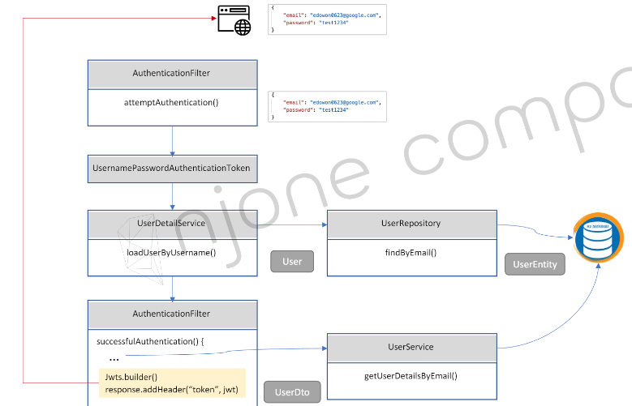

# Spring Security
* Spring Security의 실제적인 구현은 서블릿 필터 (`javax.servlet.Filter` 인터페이스 구현체) 를 통해 이루어짐
* 즉, Spring Security는 필터의 집합체
* Spring Security는 인증과 인가에 관련된 로직을 처리해주는 역할을 함

## Todo 정리
* [pdf 경로](https://github.com/joneconsulting/msa_with_spring_cloud/blob/main/pdf/Section%206.%20Users%20Microservice-part2.pdf)
* 
* [spring security docu](https://docs.spring.io/spring-security/reference/servlet/architecture.html)
* [security](https://velog.io/@pooh6195/Spring-Security-%EB%BD%80%EA%B0%9C%EA%B8%B0-Spring-Security-Architecture)
* [servlet](https://velog.io/@pooh6195/Spring-%EB%BD%80%EA%B0%9C%EA%B8%B0-Servlet-%EB%9E%80)
* [정리1](https://velog.io/@dlthgml0108/Spring-Security-%EC%9D%B8%EC%A6%9D%EA%B3%BC-%EC%9D%B8%EA%B0%80)
* [정리2](https://soojae.tistory.com/54)

## Apache Tomcat & Spring Container 구조

## Filter & Interceptor 동작

## Servlet Filter 란?