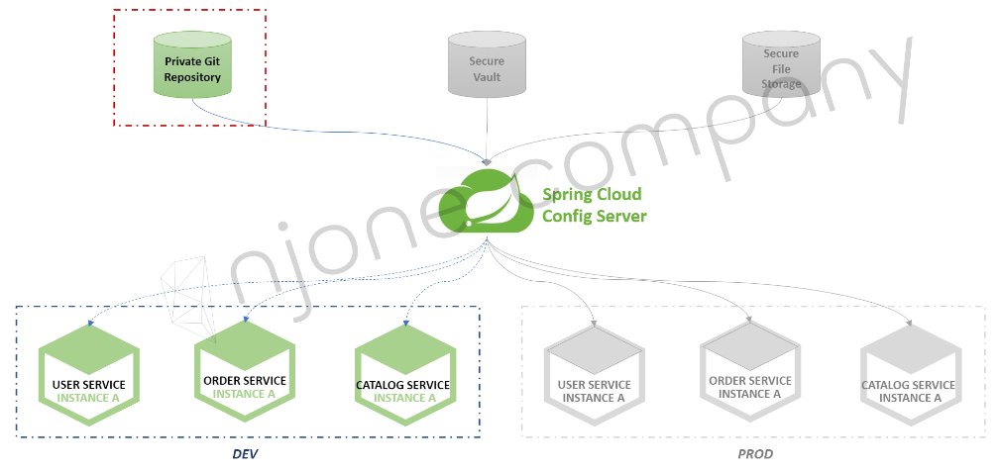

# Configuration Service
* Spring Cloud Config를 이용하여 설정 정보들을 관리
  * 분산 시스템에서 서버/클라이언트 구성에 필요한 설정 정보(yaml파일)를 외부 시스템에서 관리
  * 하나의 중앙화된 저장소에서 구성 요소 관리가 가능
  * 각 서비스를 다시 빌드하지 않고 바로 적용 가능
  * 배포 파이프라인을 통해 Dev - Uat(user acceptance testing) - Prod 환경에 맞는 설정 정보 사용
  * 